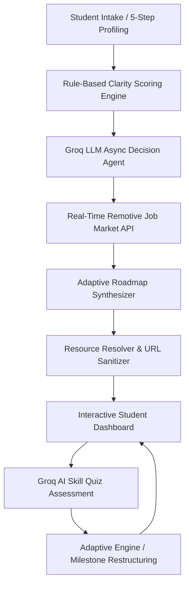

# 🚀 SkillRoute — AI Career Decision & Adaptive Learning Platform
### *The Autonomous Career Decision Agent & Personalized Learning Engine*

---

## 📑 Table of Contents
1. [🏆 Executive Summary & Pitch Hook](#1-executive-summary--pitch-hook)
2. [🎯 Problem Statement & Market Opportunity](#2-problem-statement--market-opportunity)
3. [💡 The SkillRoute Solution: "Decision, Not Just Advice"](#3-the-skillroute-solution-decision-not-just-advice)
4. [🧠 AI Decision Agent Architecture & Logic Layer](#4-ai-decision-agent-architecture--logic-layer)
5. [🛠️ Tech Stack & Engineering Highlights](#5-tech-stack--engineering-highlights)
6. [✨ Key Features & Modules](#6-key-features--modules)
7. [📊 Live Market Demand & Real-Time Job Engine](#7-live-market-demand--real-time-job-engine)
8. [🔄 Adaptive Learning Loop & Skill Assessment](#8-adaptive-learning-loop--skill-assessment)
9. [🎬 Live Presentation & Demo Script (Round 1 & Round 2)](#9-live-presentation--demo-script-round-1--round-2)
10. [🛡️ Judge Defense Matrix (Tough Q&A Answers)](#10-judge-defense-matrix-tough-qa-answers)
11. [⚔️ Competitive Advantage Matrix](#11-competitive-advantage-matrix)
12. [📈 Scalability, Business Model & Future Roadmap](#12-scalability-business-model--future-roadmap)

---

## 1. 🏆 Executive Summary & Pitch Hook

### The 30-Second Winning Hook (Say this first!):
> *"8 out of 10 students suffer from **career decision paralysis**. They waste months watching random YouTube tutorials, collecting unread Udemy certificates, and following hype instead of structured skill development.
> 
> Existing platforms give you a catalog of 10,000 courses and expect you to know what to learn. **SkillRoute is the opposite: it is an autonomous AI Decision Agent that analyzes your skills, interests, and learning velocity to DECIDE your highest-probability career path, and builds a time-bound, adaptive learning roadmap with live market job validation.** 
> 
> It's the difference between buying a paper map and turning on Google Maps GPS for your career."*

---

## 2. 🎯 Problem Statement & Market Opportunity

### The Dilemma of Modern Tech Learning:
* **Overwhelming Choices:** Over 150+ sub-specializations in tech (Generative AI, MLOps, Cloud Arch, Backend Microservices, Web3, Cybersecurity).
* **Zero Personalization:** Traditional course catalogs treat a 1st-year fresher the same as a final-year CS student.
* **No Real-Time Market Feedback:** Curriculums lag behind actual hiring trends by 2–3 years.
* **Lack of Accountability:** 90%+ of MOOC (Massive Open Online Courses) enrollments are never completed due to lack of milestone structure and pacing.

```
Traditional Learning:  Confusion ──> Course Hopping ──> Burnout ──> Zero Job Readiness
SkillRoute Paradigm:   Profile ───> AI Decision Engine ───> Adaptive Roadmap ───> Live Jobs & Job Ready
```

---

## 3. 💡 The SkillRoute Solution: "Decision, Not Just Advice"

SkillRoute eliminates guesswork with a 4-tier autonomous pipeline:

| Tier | Function | What Happens Under the Hood |
|:---|:---|:---|
| **1. Diagnostic Intake** | 5-Step Deep Profiling | Analyzes career clarity score, skill inventory, target timeline, weekly hour capacity, and goal priority (Job, Internship, Exploration). |
| **2. AI Decision Engine** | Multi-Factor Decision Agent | Evaluates 10+ career branches, calculates skill match %, market readiness index, and produces a transparent **Decision Trace**. |
| **3. Precision Roadmap** | Time-Bound Milestone Generator | Synthesizes a 4-phase milestone curriculum with verified learning resources (freeCodeCamp, YouTube, MDN, Coursera, Docs). |
| **4. Adaptive Loop** | Real-Time Feedback & Assessment | Tests competency via AI-generated skill quizzes, tracks phase completion %, and dynamically restructures remaining milestones. |

---

## 4. 🧠 AI Decision Agent Architecture & Logic Layer



### Key Engineering Architectural Strengths:
1. **Groq LPU Inference Engine:** Ultra-low latency LLM inference using Groq's high-speed chips, ensuring instantaneous roadmap synthesis (~1.5s vs 15s on typical APIs).
2. **Transparent Decision Trace:** Unlike black-box LLMs, SkillRoute returns step-by-step reasoning (`Analysis -> Paths Evaluated -> Final Decision Tradeoffs -> Alternative Paths`).
3. **Resilient JSON Recovery:** Implements automated bracket repairing (`_repair_json`) and fallback resource injection (`_ensure_resources`), ensuring 100% zero-crash uptime during live judge evaluations.
4. **Hybrid Storage Layer:** Dual persistence architecture supporting Firebase Cloud Firestore with automatic local JSON fallback for offline/isolated demo environments.

---

## 5. 🛠️ Tech Stack & Engineering Highlights

```
┌─────────────────────────────────────────────────────────────┐
│                      FRONTEND (Vite + React)                │
│  • React 18 SPA + Tailwind CSS + Lucide Icons + Framer Motion│
│  • Dark Glassmorphic Theme • Interactive Timelines & Modals │
│  • Modular State Architecture with LocalStorage Persistence │
└──────────────────────────────┬──────────────────────────────┘
                               │ REST API (JSON)
┌──────────────────────────────▼──────────────────────────────┐
│                   BACKEND (FastAPI / Python)                │
│  • High-Performance Async FastAPI with CORS Middleware      │
│  • Pydantic Schema Validation & Typing                      │
│  • Rule-Based Clarity & Matching Scoring Engine             │
└──────┬───────────────────────┬──────────────────────────────┘
       │                       │
┌──────▼───────────────┐ ┌─────▼──────────────────────────────┐
│  AI & MARKET ENGINES │ │        PERSISTENCE & STORAGE       │
│ • Groq Async LLM API │ │ • Firebase Firestore (Cloud)       │
│ • Remotive Live Jobs │ │ • Local JSON Fallback (Zero Downtime)│
│ • Dynamic Quiz Engine│ │ • Firebase Auth / Client Session   │
└──────────────────────┘ └────────────────────────────────────┘
```

---

## 6. ✨ Key Features & Modules

### 1. 🎯 5-Step Intelligent Profiling & Clarity Scoring
* Evaluates career direction, path familiarity, and goal urgency into an instant **Clarity Score (0-100%)** categorized into *Focused*, *Narrowing*, or *Exploring*.
* Collects detailed skill proficiencies across Frontend, Backend, AI/ML, Cloud, Mobile, and DevOps.

### 2. 🤖 AI Career Match Card & Decision Insights
* Visual breakdown of the **Primary Career Decision**, confidence rating, market readiness score, and estimated months to job readiness.
* **Decision Insights Modal:** Displays alternative career matches with score differentials and comprehensive skill gap analysis.

### 3. 🗺️ Visual Milestone Timeline & Curated Resources
* Interactive milestone cards categorized by difficulty (*Beginner*, *Intermediate*, *Advanced*).
* Verified links to free videos, exercises, and official documentation (no broken links, guaranteed by backend fallback resolvers).

### 4. 📝 Groq AI Dynamic Skill Quiz Generator
* Tests the student's claimed skills by dynamically generating a 5-question multi-choice assessment on the fly.
* Evaluates accuracy, highlights conceptual blind spots, and provides personalized feedback.

### 5. 💼 Real-Time Job Market & Salary Integration
* Real-time queries to live remote job feeds matching the target career title.
* Live market demand indicators (*Trending*, *Stable*, *Emerging*) and real hiring salary bands.

### 6. 📈 Learning Outcomes & Before/After Comparison
* Compares baseline capabilities upon onboarding against projected competencies after roadmap completion.
* Streak counter, phase progress meters, and dynamic progress recalculation.

---

## 7. 📊 Live Market Demand & Real-Time Job Engine

Unlike static roadmaps, SkillRoute connects directly with the live tech job market:
* **Live Remotive API Integration:** Fetches live job postings, extracting in-demand tags and skill co-occurrences.
* **Dynamic Demand Categorization:**
  * `Trending` (30+ active openings)
  * `Stable` (15–29 active openings)
  * `Emerging` (<15 active openings)
* **Live Market Salary Insights:** Gives students realistic compensation expectations across experience tiers.

---

## 8. 🔄 Adaptive Learning Loop & Skill Assessment

SkillRoute is not a one-time generator; it is an **adaptive feedback loop**:

```
[Student Completes Quiz] ──> [Score: 4/5 Intermediate]
                                     │
                                     ▼
        ┌─────────────────────────────────────────────────────────┐
        │ AI adapts remaining phases:                             │
        │ • Skips basic syntax milestones                         │
        │ • Fast-tracks to advanced architectural patterns        │
        │ • Recalculates Time-To-Job-Ready from 6 mo -> 4 mo      │
        └─────────────────────────────────────────────────────────┘
```

---

## 9. 🎬 Live Presentation & Demo Script (Round 1 & Round 2)

### ⏱️ Time Budget: 5 Minutes (Pitch + Demo)

#### **0:00 - 1:00 | The Hook & Problem (Speaker 1)**
* *"Judges, when a student decides to enter tech today, they face over 100 career titles and thousands of courses. Most quit halfway because they don't have a personalized order of execution."*
* Introduce **SkillRoute**: *"The autonomous AI platform that decides, builds, and adapts your path to career readiness."*

#### **1:00 - 3:00 | The Live Demonstration (Speaker 2)**
1. **Launch 5-Step Profiling:** Select a real-world student persona (e.g., Python + SQL knowledge, wants an AI/ML or Data Career, 10 hrs/week).
2. **Hit "Generate Decision & Roadmap":** Point out the Groq AI loading animation and note the sub-2-second generation speed.
3. **Show Career Match Card & Decision Trace:** Explain the confidence score, why AI chose this path, and the evaluated alternatives.
4. **Explore the Roadmap Timeline:** Expand a milestone to show verified curated resources with estimated completion hours.
5. **Trigger Live Job Listings & Market Demand:** Show the live remote jobs and salary range fetched directly for this path.
6. **Take the Skill Assessment Quiz:** Answer questions to demonstrate AI evaluation and dynamic feedback.

#### **3:00 - 4:00 | Technical Architecture & Feasibility (Speaker 3)**
* Highlight FastAPI backend, Groq LLM integration, real-time market API, and dual storage persistence.
* Emphasize zero reliance on fake data: everything generated is dynamic and validated.

#### **4:00 - 5:00 | Impact, Business Viability & Conclusion (All)**
* Target audience: 18–25 age group, colleges, and placement cells.
* Concluding punchline: *"SkillRoute is not a course catalog; it is your AI career co-pilot."*

---

## 10. 🛡️ Judge Defense Matrix (Tough Q&A Answers)

### Q1: "How is this different from Roadmap.sh or Coursera?"
> **Winning Answer:** *"Roadmap.sh provides static, one-size-fits-all roadmaps for everyone. Coursera sells individual courses without telling you what order you need for your exact background. SkillRoute is profile-aware: it takes your existing skills, time constraints, and pace to DECIDE the optimal path and customizes the difficulty level dynamically."*

### Q2: "What if the AI makes a wrong career recommendation?"
> **Winning Answer:** *"SkillRoute includes a transparent Decision Trace and shows ranked alternative paths with match scores. If the student's interests change, the profile can be adjusted anytime, triggering an instant re-evaluation. Furthermore, the Skill Quiz tests actual ability, preventing over-optimistic or incorrect pacing."*

### Q3: "How do you ensure AI-generated URLs aren't hallucinated or broken?"
> **Winning Answer:** *"We built a multi-stage validation layer in Python. The LLM is strictly prompted for authoritative domains, and backend post-processing (`_ensure_resources`) scans every generated milestone. If a URL is empty or malformed, our fallback engine automatically injects verified, curated tutorials from freeCodeCamp, YouTube, and MDN."*

### Q4: "How does this platform scale for thousands of students?"
> **Winning Answer:** *"The frontend is a lightweight SPA hosted on edge CDN. The backend is built with asynchronous FastAPI, handling high-concurrency I/O. The LLM workload is offloaded to Groq's high-throughput LPU cloud, and the database utilizes Firebase Firestore's automatic horizontal scaling."*

### Q5: "How does SkillRoute monetize?"
> **Winning Answer:** *"We have a dual B2C and B2B model:
> 1. **B2C Freemium:** Free roadmap generation and core learning paths; Premium tier for AI resume review, mock technical interviews, and automated portfolio project verification.
> 2. **B2B University / Bootcamps:** Licensing the SkillRoute dashboard to university placement cells to track student industry-readiness and bridge curriculum gaps."*

---

## 11. ⚔️ Competitive Advantage Matrix

| Feature / Dimension | SkillRoute AI | Roadmap.sh | Coursera / Udemy | ChatGPT / Claude |
|:---|:---:|:---:|:---:|:---:|
| **Autonomous Career Decision** | ✅ **Yes (AI Agent)** | ❌ Static tree | ❌ Browse catalog | ⚠️ Chat response |
| **Pace & Time-Aware Planning** | ✅ **Yes (Hours/Week)** | ❌ No | ❌ No | ❌ Unstructured |
| **Real-Time Job Market Data** | ✅ **Yes (Live Remotive API)** | ❌ No | ❌ No | ❌ Knowledge cutoff |
| **Interactive Skill Assessment** | ✅ **Yes (Groq QuizBot)** | ❌ No | ⚠️ Paid quizzes | ❌ Text only |
| **Live Milestone Progress Tracking**| ✅ **Yes** | ⚠️ Static checks | ⚠️ Platform only | ❌ No |
| **Transparent Decision Trace** | ✅ **Yes (Step-by-step)** | ❌ No | ❌ No | ❌ Black-box |
| **Curated Free Resources** | ✅ **Yes (Zero Paywalls)**| ⚠️ Mixed | ❌ Paid courses | ⚠️ Generic URLs |

---

## 12. 📈 Scalability, Business Model & Future Roadmap

```
                    ┌──────────────────────────────────────────────────┐
                    │               FUTURE ROADMAP                     │
                    └──────────────────────────────────────────────────┘
                                             │
      ┌──────────────────────────────────────┼──────────────────────────────────────┐
      ▼                                      ▼                                      ▼
[Phase 1: Present]                     [Phase 2: Q3 2026]                     [Phase 3: 2027]
• AI Career Decision Engine            • GitHub Project Auto-Grader           • B2B University Placement Portal
• Adaptive 4-Phase Roadmap             • AI Mock Technical Interviews         • Direct Employer Hiring Pipeline
• Live Market Job Feed                 • Peer Learning Cohorts & Mentors      • AI Resume & Portfolio Builder
```

### Social & Educational Impact:
* **Democratizing Quality Guidance:** Delivers elite 1-on-1 career counseling to tier-2/3 college students who lack dedicated placement mentors.
* **Saving Hundreds of Hours:** Condenses 50+ hours of scattered internet research into a focused, executable 12-week roadmap.
* **Closing the Industry-Academia Gap:** Aligns student preparation directly with live job market skill tags.

---

## 🏁 Summary Checklist for the Presentation Day

- [x] **Backend Live / Local Storage active:** Ready with fast Groq API responses.
- [x] **Frontend UI Clean & Responsive:** High-contrast dark mode with Framer Motion transitions.
- [x] **Demo Persona Prepared:** Python/Data Science or Full-Stack persona ready to input.
- [x] **Presentation Deck Aligned:** Follow the 6-slide structure corresponding to the sections above.
- [x] **Confidence & Clarity:** Keep the narrative focused on **Decision + Adaptation + Real Outcomes**.

🏆 **SkillRoute — Built to Win.**
